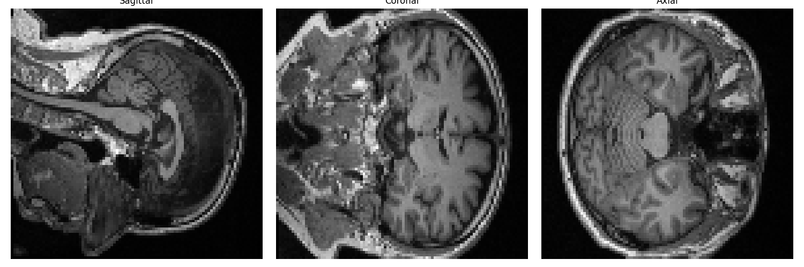

# FTD-MultiModal-Transformer

<p align="center">
  
</p>

<h1 align="center">
Frontotemporal Dementia Prediction using Multimodal Transformers, Graph Neural Networks and Self-Supervised Learning
</h1>

<p align="center">
Research-Oriented Neuroimaging Framework for Early Detection of Frontotemporal Dementia (FTD)
</p>

---

## Overview

FTD-MultiModal-Transformer is an end-to-end deep learning framework designed for the analysis of structural MRI scans and prediction of Frontotemporal Dementia (FTD).

The project combines modern medical imaging techniques, graph neural networks, transformer architectures, and self-supervised learning to create a scalable pipeline for neurodegenerative disease analysis.

The framework performs:

* MRI data auditing and validation
* Image preprocessing
* Skull stripping
* Quality control visualization
* MNI registration
* ROI feature extraction
* Brain graph construction
* Masked Autoencoder (MAE) pretraining
* Graph Attention Network (GAT) learning
* Swin Transformer encoding
* Multimodal feature fusion
* Longitudinal transformer modeling
* Risk classification

---

## Architecture

```text
MRI Acquisition
        │
        ▼
Data Audit & Validation
        │
        ▼
MRI Preprocessing
        │
        ▼
HD-BET Skull Stripping
        │
        ▼
Quality Control
        │
        ▼
MNI Registration
        │
        ▼
ROI Extraction
        │
        ▼
Brain Graph Construction
        │
        ▼
Masked Autoencoder (MAE)
        │
        ▼
Graph Attention Network (GAT)
        │
        ▼
Swin Transformer Encoder
        │
        ▼
Multimodal Feature Fusion
        │
        ▼
Longitudinal Transformer
        │
        ▼
Risk Classification
        │
        ▼
FTD Prediction
```

---

## Project Workflow

### Step 1 – Data Audit

```text
step1_extract_and_audit.py
```

Performs dataset inspection, integrity verification, and MRI metadata auditing.

### Step 2 – MRI Preprocessing

```text
step2_preprocessing.py
```

Handles normalization, resizing, denoising, and preprocessing operations.

### Step 3 – Visualization

```text
step3_visualize_preprocessed.py
```

Generates visual inspection outputs for preprocessing validation.

### Step 4 – Skull Stripping

```text
step4_skull_stripping.py
```

Removes non-brain tissue using HD-BET style processing.

### Step 5 – Quality Control

```text
step5_qc_visualization.py
```

Provides quality assessment visualizations.

### Step 6 – MNI Registration

```text
step6_mni_registration.py
step6_fast_mni_registration.py
```

Aligns MRI scans to standard MNI space.

### Step 7 – ROI Feature Extraction

```text
step7_roi_extraction.py
```

Extracts neuroanatomical region-based features.

### Step 8 – Brain Graph Construction

```text
step8_graph_construction.py
```

Creates graph representations of brain regions and connectivity.

### Step 9 – Label Generation

```text
step9_create_labels.py
```

Builds disease classification labels.

### Step 10 – Graph Dataset Creation

```text
step10_graph_dataset.py
```

Creates graph-based training datasets.

### Step 11–13 – Self-Supervised MAE Learning

```text
step11_mae_pretraining.py
step12_mae_model.py
step13_mae_training.py
```

Learns MRI representations through Masked Autoencoder pretraining.

### Step 14 – Graph Attention Network

```text
step14_gat_model.py
```

Models relationships among brain regions using graph attention.

### Step 15 – Swin Transformer Encoder

```text
step15_swin_encoder.py
```

Extracts hierarchical visual features from MRI data.

### Step 16 – Feature Fusion

```text
step16_feature_fusion.py
```

Combines graph, image, and clinical representations.

### Step 17 – Longitudinal Transformer

```text
step17_longitudinal_transformer.py
```

Models disease progression over time.

### Step 18 – Risk Classification

```text
step18_risk_classifier.py
```

Predicts FTD risk and diagnostic outcomes.

### Step 19 – Dataset Indexing & Alignment

```text
step19_build_dataset_index.py
step19_verify_alignment.py
```

Ensures multimodal consistency and indexing.

### Step 20–23 – Full Multimodal Pipeline

```text
step20_train_pipeline.py
step21_real_dataset_loader.py
step22_real_multimodal_pipeline.py
step23_full_model.py
```

Complete training and inference pipeline.

---

## Technology Stack

### Deep Learning

* PyTorch
* TorchVision
* Transformers

### Medical Imaging

* Nibabel
* Nilearn
* MONAI

### Graph Learning

* PyTorch Geometric
* NetworkX

### Machine Learning

* Scikit-Learn
* NumPy
* Pandas

### Visualization

* Matplotlib
* Seaborn

---

## Dataset

The dataset is not included in this repository.

Medical imaging datasets are excluded because:

* Large storage requirements
* Privacy constraints
* Research licensing restrictions

Expected structure:

```text
data/
├── nifti/
├── skull_stripped/
├── mni_registered/
├── roi_features/
├── graphs/
├── preprocessed/
└── splits/
```

---

## Research Directions

* Vision Mamba Integration
* Foundation Models for Neuroimaging
* Federated Medical Learning
* Explainable AI for Clinical Decision Support
* Self-Supervised MRI Representation Learning
* Cross-Dataset Generalization

---

## Applications

* Early FTD Detection
* Neurodegenerative Disease Monitoring
* Clinical Decision Support
* Brain Connectivity Analysis
* Medical Imaging Research

---

## Author

**Manikandan**

B.Tech Artificial Intelligence and Data Science

Research Interests:

* Medical AI
* Neuroimaging
* Graph Neural Networks
* Transformers
* Self-Supervised Learning
* Multimodal Deep Learning

---

## License

This project is released under the MIT License.
